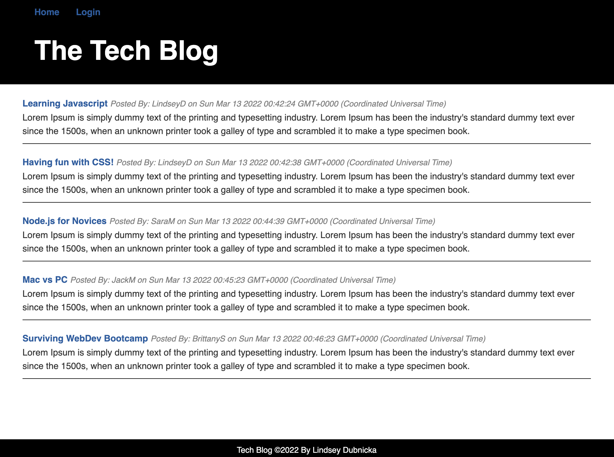
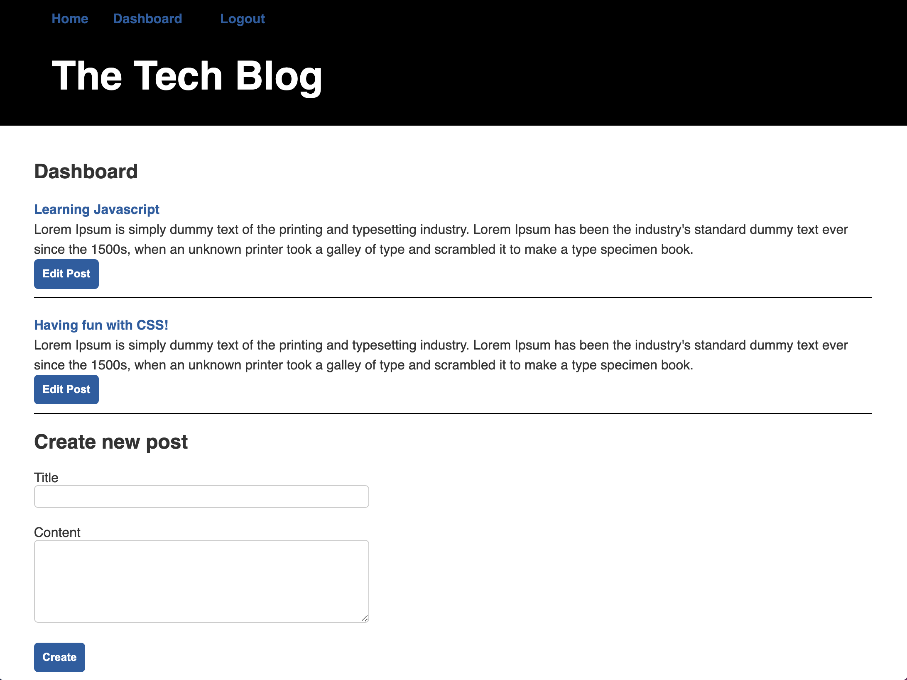
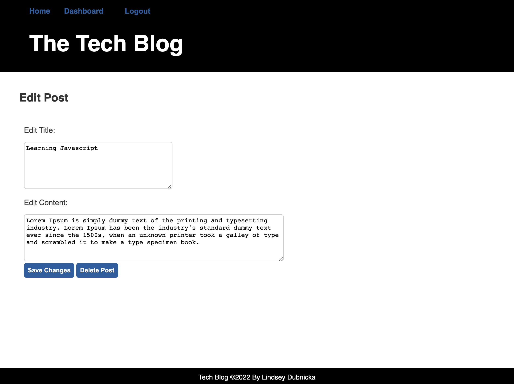
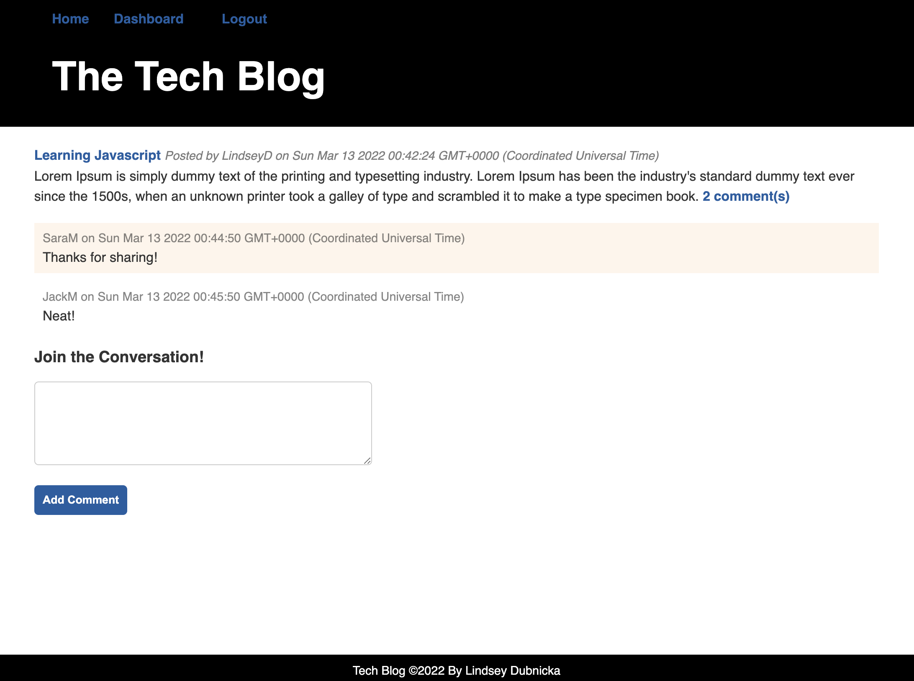

# Tech Blog 

## Description
This repository contains the application code for a CMS-style blog site where developers can publish their blog posts and comment on other developers' posts. This app follows the MVC paradigm in its architectural structure, using Handlebars.js as the templating language, Sequelize as the ORM, and the express-session npm package for authentication. 

## Deployed Website
This application is deployed on Heroku.  
https://thawing-sierra-85739.herokuapp.com 

## Usage
The screen shots below will give you an idea of how this application should work. If you are a new user, you will need to sign-up first. 

Visiting the homepage:  
  
 
Visiting your dashboard:  
  
 
Edit a post:  
  
 
Leave a comment:  
  

## Questions
Feel free to reach out to me for any questions or comments.  
Link to my GitHub: github.com/lindseymiller2567